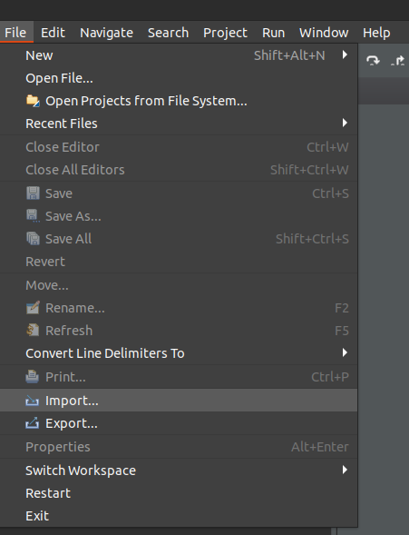
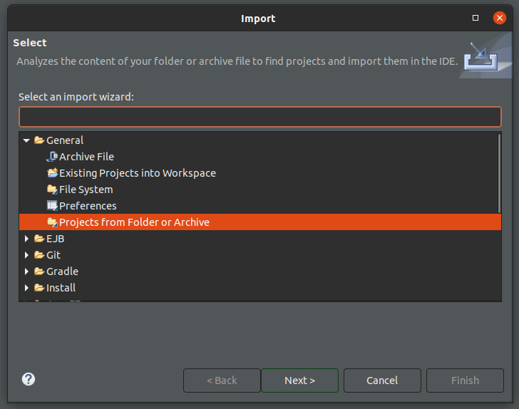
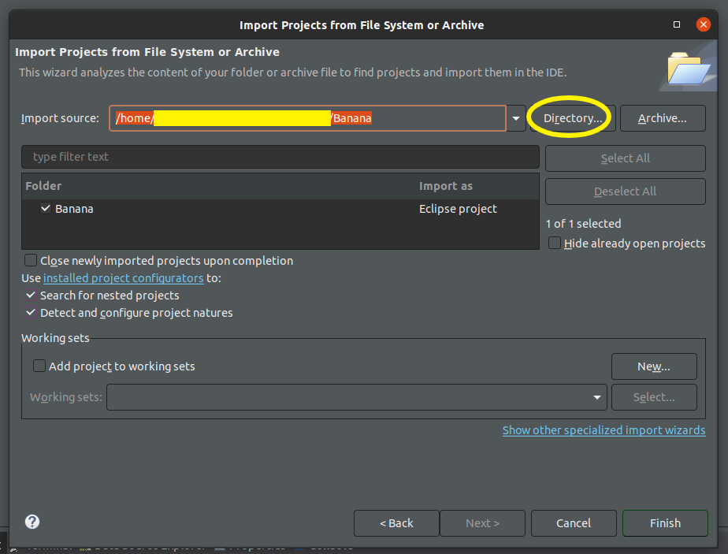
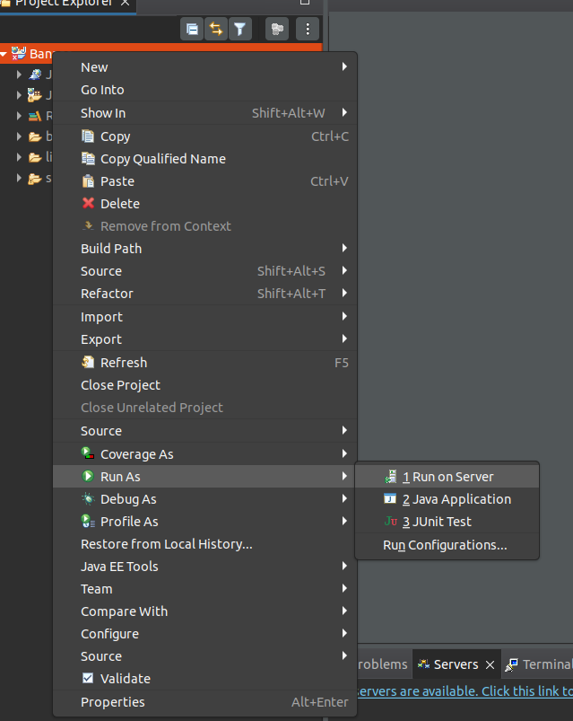
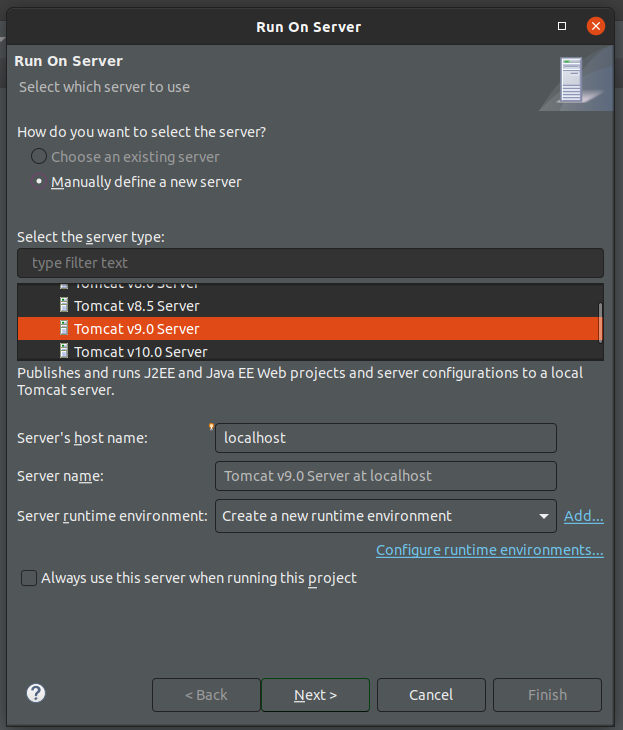
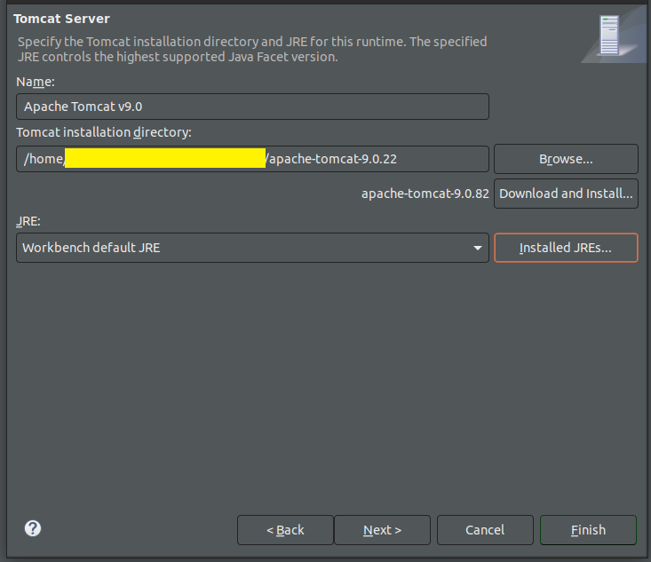

# 
Banana

  <a href="#track">Track</a> •
  <a href="#document">Document</a> •
  <a href="#some-examples">Some Examples</a> •  
  <a href="#technologies">Technologies</a> •
  <a href="#java-web-app">Java Web App</a> •
  <a href="#how-to-use">How To Use</a> •
  <a href="#authors">Authors</a>

A full Software Engineering project that aims to cover every aspect of this subject. The project is divided into four macrosteps: requirements analysis, problem analysis, design, deployment. 

**Abstract**: *Il nostro progetto si pone come obiettivo quello di creare una piattaforma che permette di visualizzare tutti gli eventi che avranno luogo in una determinata zona. Gli utenti potranno effettuare ricerche secondo le loro le preferenze e selezionando l'area d'interesse. Inoltre, previa registrazione, gli stessi potranno condividere e mostrare l'interesse verso uno o più eventi. Ognuno di questi oltre ad una breve descrizione presenterà il numero di persone interessate. Quest'ultimi sono organizzati dagli organizzatori, i quali avranno a disposizione un'interfaccia dedicata dove poter inserire e fornire maggiori informazioni.*

**English Version**: *Our project aims to create a platform that allows you to view all the events that will take place in a specific area. Users will be able to carry out searches according to their preferences and select the area of interest. Furthermore, before registering, they will be able to share and show interest in one or more events. Each of these, in addition to a brief description, will present the number of people interested. The latter are organized by the organizers, who will have a dedicated interface where they can enter and provide more information.*

## Track: 
Progetto a tema libero con focalizzazione sui seguenti passaggi:
- Analisi dei requisiti
- Analisi del problema
- Progettazione dell'applicazione
- Realizzazione di un prototipo

 **English** 
Free topic's project aiming in the sequent subjects:
- Requests analysis
- Problem analysis
- Application design
- Prototype development

## Documents:
[Banana PDF](/Completo.pdf): Lorem ipsum dolor sit amet, consectetur adipiscing elit, sed do eiusmod tempor incididunt ut labore et dolore magna aliqua. Ut enim ad minim veniam, quis nostrud exercitation ullamco laboris nisi ut aliquip ex ea commodo consequat. Duis aute irure dolor in reprehenderit in voluptate velit esse cillum dolore eu fugiat nulla pariatur. Excepteur sint occaecat cupidatat non proident, sunt in culpa qui officia deserunt mollit anim id est laborum.

## Some Examples:
L'applicazione comprende tutte le funzionalita` descritte dettagliatamente dal [Documento](/Completo.pdf). E` stata rilasciata inoltre una prima implementazione d'esempio per capire il reale funzionamento, ed una prima strutturazione dell'applicativo. 
Come si puo` notare nelle figure sottostanti sono delineate e mostrate le principali caratteristiche per l'utilizzo come il login, la registrazione e la ricerca degli eventi.

## Technologies:

     
     
    
     
     
     
     
     
    
     
    <a href="<link-to-gson>" target="_blank" rel="noreferrer"> 
        " alt="gson" width="40" height="40"/> 
    </a> 

<!-- uml -->
<a href="<link-to-uml>" target="_blank" rel="noreferrer"> 
    " alt="uml" width="40" height="40"/> 
</a> 

<!-- open street map -->
 

<!-- leaflet -->
 

<!-- photon komoot -->
<a href="https://www.photon.komoot.io/" target="_blank" rel="noreferrer"> 
    " alt="photon komoot" width="40" height="40"/> 
</a>

## Java Web App:
[Banana Deployment](./Banana/) 
#### How To Use:
1. Download [Banana](./Banana/) and [Apache-Tomcat](./apache-tomcat-9.0.22/)
2. Open [Eclipse](https://www.eclipse.org/) and import the project.  *File > Import > Projects from Folder or Achieve.*
    

Show Me

    
    
    

     
3. Select the [Banana](./Banana/) directory previosly downloaded and then "Finish"
 
Show Me

    
    

     
4. Right click on the Banana in the project explorer and then: *Run As > Run on Server.*
    
 
Show Me

    
    

     
5. Define a new server manually, choose Apache, then **"Tomcat v9.0 Server"** and click on the *Next* button.
    
 
Show Me

    
    

     
6. Now choose [Apache-Tomcat](./apache-tomcat-9.0.22/) downloaded before, it contains all the correct configuration, and click the *Finish* button.
    
 
Show Me

    
    

     

7. The project should start by itself, now Have Fun!

  

  

##### Authors:

*July 2022* 
**Davide Moricoli, Gabriele Cianni, Leonardo Giovannini**
